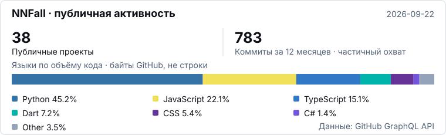

# Никита · NNFall

### Fullstack-разработчик (Middle) / AI Engineer

Разрабатываю веб-продукты и прикладные AI-сервисы. Основной фокус — Python-backend, интеграция языковых моделей и продуктовые интерфейсы на JavaScript/TypeScript. Работаю как в команде, так и самостоятельно над собственными продуктами и заказными проектами.

Занимаюсь не только реализацией отдельных функций: разбираю задачу с заказчиком, проектирую API и модель данных, связываю внешние сервисы, разворачиваю приложение и дорабатываю его по обратной связи. В проектах работаю с личными кабинетами, платежной логикой, CRM, мессенджерами и обработкой документов.

[Telegram](https://t.me/kiperovka) · [Kaigo](https://kaigo.space/)

## Технологии

  
  
  
  
   
  
  
  
  

- **Backend:** Python, Django, FastAPI, aiohttp; REST API, webhooks, авторизация и разграничение доступа.
- **Frontend:** JavaScript, TypeScript, React, HTML/CSS; интерфейсы продуктов, личные кабинеты и адаптивные сайты.
- **AI и интеграции:** LLM API, агентные сценарии, обработка документов и аудио, Telegram Bot API и внешние бизнес-сервисы.
- **Данные и инфраструктура:** PostgreSQL, MySQL, Redis, Docker, Linux/VPS и Nginx. В отдельных мобильных проектах использую Flutter/Dart.

## Опыт работы

### ДжиАйТи · G-ROBOT / GCollect

**Июнь 2026 — настоящее время · продуктовая разработка**

Работаю над Django-приложением G-ROBOT/GCollect: клиентским интерфейсом системы роботизированных обзвонов, взаимодействием с API, аудиозаписями и отчётами. Развиваю существующий продукт в команде, с учётом его архитектуры и текущих пользовательских сценариев.

- Дорабатываю серверную и интерфейсную части приложения, связываю пользовательские действия с API и бизнес-логикой.
- Улучшаю понятность интерфейса: навигацию, названия, подсказки и последовательность действий в личном кабинете.
- Работаю через отдельные Git-ветки и ревью; проверяю изменения в локальном окружении перед передачей в проект.

### PRO Review

**Август 2025 — январь 2026 · AI-специалист**

Занимался прикладным использованием AI в рабочих процессах: подбором инструментов под задачи бизнеса, настройкой сценариев работы с моделями и автоматизацией повторяющихся операций. В этой работе важна была не сама генерация, а применимость результата к конкретной задаче и его качество.

### SkillPointApp

**Июнь — сентябрь 2025 · Backend-разработчик**

Работал в команде AI/EdTech-платформы для обучения врачей. Отвечал за Python-backend и серверную логику web- и Telegram-приложения, взаимодействовал с frontend-разработчиками.

- Авторизация, роли пользователей и разграничение доступа между школами и организациями.
- Бизнес-логика обучения, рейтинги и платёжные сценарии.
- API для клиентских приложений и согласование взаимодействия между frontend и backend.

### Проектная разработка

**С 2024 года · заказные проекты и собственные продукты**

Создаю backend-сервисы, Telegram-ботов и AI-интеграции: от уточнения задачи и первого рабочего сценария до развёртывания на сервере и последующих доработок. Часть проектов веду параллельно с основной работой.

Работал с генерацией текста, изображений и презентаций, обработкой аудио, внешними API, пользовательскими кабинетами и административными инструментами. Настраиваю Docker-окружение, базы данных, конфигурацию сервера и обновление приложения через Git. Для заказных проектов исходники и внутреннюю документацию не публикую; ниже собраны собственные продукты и доступные портфолио-примеры.

## Собственные продукты

### Kaigo Widgets · AI-консультанты для сайтов

Разрабатываю веб-продукт, в котором можно настроить AI-консультанта и встроить его на сайт. Проект объединяет работу с моделями, серверную обработку сообщений и интерфейсы для владельца бизнеса.

- Backend на Python/aiohttp, хранение данных в PostgreSQL и работа с историей диалогов.
- Кабинет клиента, управление виджетами, настройками консультанта и обращениями пользователей.
- Интеграция Gemini API, административные инструменты и развёртывание через Docker.

[Репозиторий](https://github.com/NNFall/widgets) · [Сайт](https://kaigo.space/)

### Slide Maker AI · генерация презентаций

Создаю веб-сервис для подготовки презентаций с помощью AI. В проекте работаю над пользовательским интерфейсом, backend и связкой между генерацией материалов, аккаунтами и экспортом результата.

- Интерфейс на React/TypeScript и API на FastAPI.
- Интеграция AI-провайдеров, обработка слайдов и подготовка файлов презентаций.
- Авторизация, подписки, платёжные интеграции и инструменты администрирования.

[Репозиторий](https://github.com/NNFall/DMSlideAi) · [Сайт](https://slide-maker-ai.com/)

### HearSpan AI · Windows-ассистент для работы с разговорами

Собственный desktop-продукт: транскрибация микрофона и системного звука в реальном времени, затем потоковый ответ с учётом контекста разговора. Работаю над приложением, серверной частью и доставкой обновлений пользователям.

- Обработка аудио и интеграция Gemini Live.
- Защищённое WSS-соединение, проверка доступа и учёт времени использования на сервере.
- Telegram-бот для управления доступом, Windows-установщик, диагностика и документация.

Проект находится в beta; публичный репозиторий содержит описание и релизы, исходный код закрыт.

[Страница проекта и релизы](https://github.com/NNFall/HearSpanAI) · [Сайт](https://kaigo.space/hearspan-ai/)

## Сайты и интерфейсы

Помимо веб-сервисов, разрабатываю адаптивные сайты: продумываю структуру страниц, реализую интерфейс и анимацию, оптимизирую медиа и проверяю отображение на разных экранах. Два примера этой работы:

- **Точка притяжения.** Сайт кофейни, бара и галереи: меню, фотогалерея, события и контакты. React, TypeScript, Vinext/Vite. [Репозиторий](https://github.com/NNFall/dotgravity) · [Демо](https://kaigo.space/site/dotgravity/).
- **White Cup.** Сайт кофейни с меню, историей места, событиями и мобильной навигацией. React, TypeScript, Vite. [Репозиторий](https://github.com/NNFall/whitecup) · [Демо](https://kaigo.space/site/whitecup/).

Это портфолио-демо, а не заявление об официальном сотрудничестве с заведениями. Коммерческие исходники и внутренние материалы работодателей остаются закрытыми.

## Код и активность

<picture>
  <source media="(prefers-color-scheme: dark)" srcset="assets/generated/profile-stats-dark.svg" />
  
</picture>

Что входит в статистику

Показатели обновляются автоматически через GitHub Actions. Языки считаются по объёму кода в публичных собственных репозиториях, без форков, архивов и этого README-репозитория. Это байты, определённые GitHub, а не число лично написанных строк или оценка опыта.

Коммиты показаны за последние 12 месяцев только по публичным неархивным репозиториям без форков. Если выборка API неполная, изображение отмечает частичный охват. Закрытая рабочая активность сюда не включается.

[Методика и ограничения](docs/stats-methodology.md) · [Исходные агрегаты](assets/generated/stats.json) · [Обновления](https://github.com/NNFall/NNFall/actions/workflows/profile-stats.yml)

